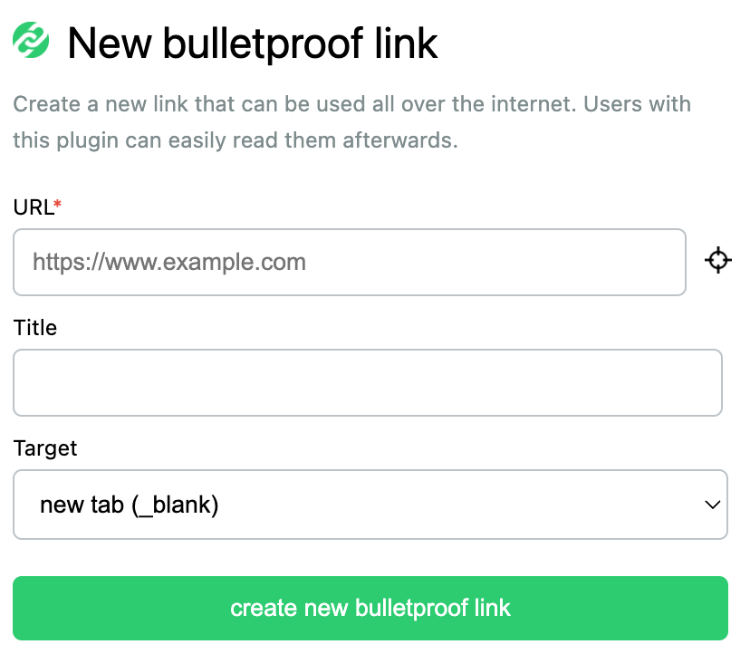

# Bulletproof Link Chrome extension

Bulletproof links are a new way to use links in a website. They will be replaced by the browser (e.g. Chrome extension) and therefore can't be blocked by the website itself. 

With bulletproof links it is possible to add links to all kind of websites like Instagram, Pinterest or chats. 

